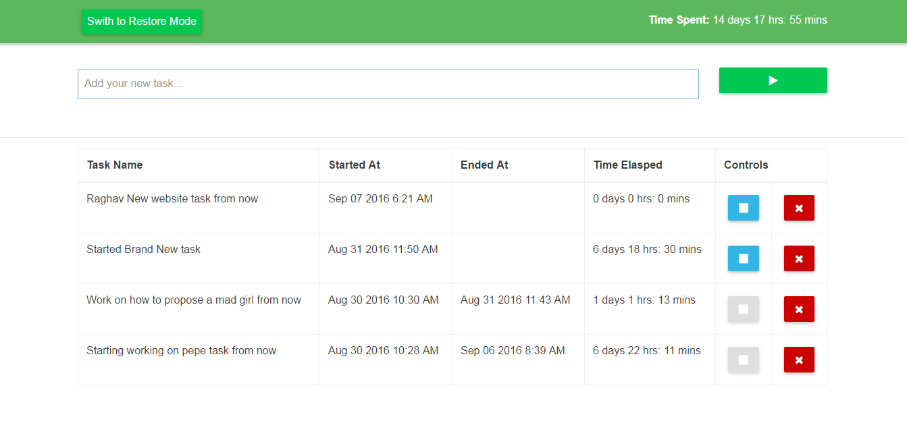

# Time Tracker
This web application helps you to monitor what you did for how long. Sometimes it's cumbersome to track the exact time you invested in a particular project. This app solves this problem. You can add many tasks as you get involved in.

<h2>Demo</h2>
Deployed on Heroku for the demonstration purpose. Find Demo <a href="https://time-traker.herokuapp.com/ target="_blank"> here</a>
 
<h2>Features</h2>
<ul>
<li> Add, stop, delete and restore tasks without reloading pages. </li>
<li> Responsive and simple UI </li>
<li> Uses json file to store data. No need to depend on any database. </li>
</ul>

<h2>How to install on your system </h2>

<ul>
<li>Clone this repository on your system</li>
<li>Run XAMP, MAMP or any php server. or simply paste all file on your remote server.</li>
<li>Delete all the data from data.json file (if there is any) to store fresh new task.</li>
<li>That's it. Enjoy using app and tracking your app without any hassle of pen and paper.</li>
</ul>

<h2>Note: </h2>

I build this web app when I was learning AJAX and JQuery with PHP. App  may contain some bugs. Feel free to modify and send pull request.
